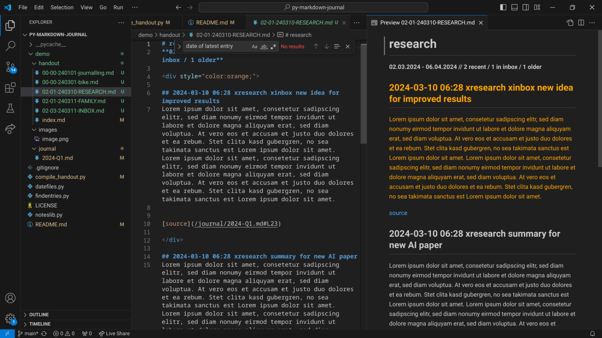

# py-markdown-journal
tools for markdown-based journalling

## Idea
When jotting down your (meeting) notes, you usually don't have the time to think much about where exactly to put them and how to organize your notes.
This small toolkit enables you to simply write down all of your meeting minutes, ideas, thoughts, and other notes in chronological order, in one simple file (or more files, if you prefer).
Instead of thinking about file structures, you simply put everything in one place and tag your daily notes.

The compile\_handout-script generates a "handout" for your notes, i.e., for each tag, a dedicated markdown file is generated, subsuming all relevant journal entries.
The script can also be used to highlight recent entries, e.g., from the last 2 weeks, which enables the user to get a quick glimpse on recent additions.

All words starting with an "x" are considered as a tag, e.g., by adding the word "xjournalling" somewhere in your journal, the respective tag is assigned to that journal entry.
The "xinbox" tag is considered as a special tag. This tag can be used to mark entries that need to be revised at some later point in time.
Therefore, journal entries with that tag assigned will be highlighted in the generated "handout".

## Example for the journal file
## 20240201 xjournalling telephone call with expert group
- the following ideas have been discussed:
  - the new journalling method improves productivity by 10%
  - ...

## 20240203 xinbox meeting with boss
- important things to do:
  - write technical concept for requirements engineering
  - send mail to Robert

Note here that tags start with "x".

Now, run the compile\_handout script and it will generate a nicely formatted summary that's easy to scroll through:

Prefix of generated file names is as follows:
"Number of recent entries in that file" - "number of entries in inbox" - "number of older entries"
